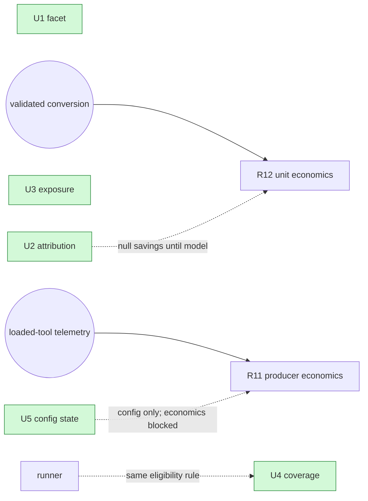

# Dynamic-Workflows plan contract — worked examples

Concrete illustrations of each element from `SKILL.md`. The example is a **detector-refinement wave**: five
units that refine existing analysis detectors, folded into an existing master-plan registry. Generalize the
shapes to your own domain — the structure transfers; the domain names don't.

---

## 1. Session-map block (Step 1 + Step 4)

Two phases, each one orchestrator session. Note the fan-out column encodes *which units parallelize and why*,
and the isolation column proves file-disjointness.

```
| Phase (1 session = 1 worktree/branch/PR = 1 Workflow) | Units | Fan-out shape | Isolation |
|---|---|---|---|
| Phase-1 — Signal refinement | U1,U2,U3,U4 | All four parallel — disjoint files. The shared constants file is a write only if a unit adds a constant (none required) → serialize only then. Verify → adversarial-verify each finding before the orchestrator commits | four disjoint `src/detectors/*` files (+ one new test); disjoint from Phase-2 |
| Phase-2 — Producer + detector | U5 | standalone (probe + detector + config source, one owner) | `src/probe.ts` + `d10_*` + settings; disjoint from Phase-1 |
```

Prose that belongs with it:

- Phase-1 is the higher-leverage lane — start there. All four units parallelize; **no guaranteed intra-phase
  collision** (the claim was verified against the code, not assumed).
- Phase-2 is cross-subsystem (touches the producer, not just a detector) and carries a downstream gate, so it
  is its own session even as a single unit.

---

## 2. Dispatch headers (Step 2)

One per unit, directly under the unit title. `owns` is the write set; `reads` is everything else the agent may
open. An agent opens **only** these files — never the plan, never the wider tree.

```
U1 — adjacent-cause facet
> Dispatch: sonnet · medium · owns `d8_churn.ts` · reads its d8 test (fixture pattern) + `pricing.ts` (tier fn) · gate G-DET

U2 — event-level attribution
> Dispatch: sonnet · medium · owns `d6_bloat.ts` · reads its d6 test (fixture pattern) + `schema.sql:52` (events table) + migration 005 (event metadata) · gate G-DET

U3 — denominator + exposure split
> Dispatch: sonnet · medium · owns `d2_long_ctx.ts` + new `test/d2.test.ts` · reads `d8_churn.test.ts` (in-memory fixture pattern) · gate G-DET

U4 — honest coverage denominator
> Dispatch: sonnet · medium · owns `d7_loop.ts` · reads its d7 test (fixture pattern) + `evidence/d7/measure.ts` (match the eligibility rule) · gate G-DET

U5 — producer config state (economics gated → follow-on)
> Dispatch: sonnet · medium · owns `probe.ts` + `d10_catalog.ts` + the confirmed local settings source · reads both tests (fixture patterns) · gate G-PROBE
```

Why `reads` matters: U4's `reads` names `evidence/d7/measure.ts` because its acceptance is *"keep the
eligibility rule identical to the already-shipped runner."* Naming that one file is the difference between the
agent honoring a contract and the agent re-inventing it (or grepping to find it).

---

## 3. Named gates (Step 3)

Defined once; referenced by name from every Dispatch header.

```
- G-DET (Phase-1, detector-only — no UI/daemon surface): lint (auto-fix touched files) · typecheck · targeted
  `vitest run test/detectors/<changed>.test.ts` · then full test. Skip UI build + smoke — no UI/daemon change.
- G-PROBE (Phase-2 — the probe runs in the daemon boot-scan): G-DET plus `smoke` to prove boot still reconciles.
- Known false-fails — do NOT report as regressions: sandbox `spawn EPERM` → rerun the identical command
  elevated; always gate from inside the phase worktree (a wrong-root run mis-reports missing deps).
```

The scoping is deliberate: Phase-1 changes no UI, so G-DET skips the UI build and the flaky UI perf gate —
which had previously produced a false regression on unchanged code.

---

## 4. Commit + worktree model (Step 4)

```
- Agents edit + gate only; the orchestrator commits, serially, via `git -C <worktree>`. Never let a subagent
  commit — cwd resets mid-run and it lands on the wrong branch.
- Phase-1's four units land on ONE branch/PR → they share ONE worktree. Do not give each agent its own
  worktree isolation; parallel writes to disjoint files in the shared tree are fine, commits are serialized.
- Give Phase-1 and Phase-2 separate worktrees only when you run them concurrently.
```

---

## 5. Context-minimization contract (Step 5)

```
- Conductor entry point: read the work-order block + this session-map only — never the whole plan.
- Agents receive the single work-order text as their prompt and never open the plan doc. Each work order is
  self-contained (owns/reads/gate + inline acceptance), so an agent opens only its owns+reads files.
- Author the shared guardrails once as a Workflow script constant prepended to every agent prompt.
- Return contract (fixed shape, nothing else): what changed · files touched · verify result (command + outcome)
  · open questions. Push diffs/logs to an artifact file; return a ≤3-line pointer so synthesis + main stay tiny.
```

Shared guardrails (the once-authored constant) look like, e.g.: *preserve the privacy boundary (no raw content
crosses the query layer); keep every threshold labeled unvalidated; a modeled dollar needs an explicit basis;
never turn a modeled estimate into an achieved total.*

---

## 6. Dependency graph + follow-on registry (Step 6)

Free nodes (no inbound edge) ship now; gated nodes carry blocker + unblocked-by.



**Follow-on registry** — everything the wave spawns, homed as a typed row, not buried inline:

```
| Follow-on | Home | Trigger |
|---|---|---|
| Producer loaded-state economics | R11 (blocked-research) | U5 ships config-state only |
| Unit economic model (dollar claim) | R12 (blocked-research) | U2 keeps savings null until a validated conversion |
| Provider-contract extension | O9 (owner-decision) | needs live provider response shape |
| Coefficient calibration policy | O10 (owner-decision) | keep both regimes vs adopt one |
| UI surfacing of new evidence fields | Wave follow-ons (a UI session, not a detector phase) | after backend lands |
| Threshold calibration | Wave follow-ons + delivery gate | after a ≥N-day measurement window |
```

Duplicates of work already tracked are **cross-linked**, not re-added:

```
| Stage in source doc | Disposition | Existing item |
|---|---|---|
| strict background detector | gated (dup) | R3 |
| effort go/no-go research | gated (dup) | R1 |
| outcome measurement | gated (dup) — extension of shipped lifecycle | R4 |
```

---

## 7. Plan-home folding (Step 7)

When a master/registry plan exists, fold in rather than spawn a doc:

1. Add ranked buildable rows for the new units.
2. Add dispatch-ready work orders (Dispatch header + Files + Change + Accept + Spec) in the work-order section.
3. Add the new blocked-research / owner-decision rows for the follow-ons.
4. Add the session-map block (phases, gates, commit model, context contract).
5. Add dependency-graph edges.
6. Add a source-doc → item cross-link table.
7. Mark the source doc absorbed (a banner pointing at the master plan; retain it in place if it doubles as an
   audit/execution record).

Verify additivity: a `git diff --stat` that is insertions-heavy with only prose lines removed confirms **no
completed item was replaced** — de-dup should happen by cross-link, never by deleting a done row.

---

## 8. The verification discipline (the meta-lesson)

The most expensive error in this class of plan is a **confidently-stated structural claim that's false** — a
collision that isn't, a file that isn't written, an "already done" that isn't. Each one either kills real
parallelism or sends an agent down a wrong path. Before writing any `owns` set, serialization note, or
"done"/"shared-write" claim: **open the file and confirm it.** A dispatch plan is only as good as the file-set
facts under it.
